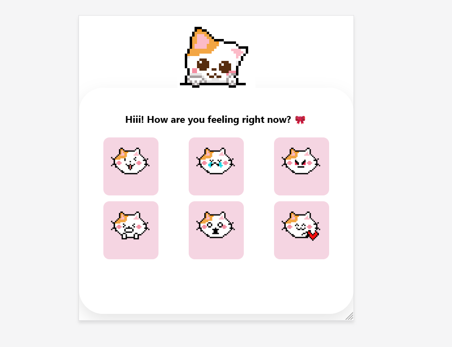

# 🐱 Current Mood Tracker

A cute pixel art mood tracker built with HTML, CSS and JavaScript.
Pick how you're feeling and let your cat reflect your mood!

## 📸 Preview

## ✨ Features

- 6 mood options with matching pixel art cats
- Soft, aesthetic pink UI
- Lightweight — no frameworks, just vanilla HTML/CSS/JS

## 🛠️ Built With

- HTML
- CSS
- JavaScript

## 🚀 How to Use

1. Clone or download the repo
2. Open `index.html` in any browser
3. Click a mood and vibe with your cat 🐱